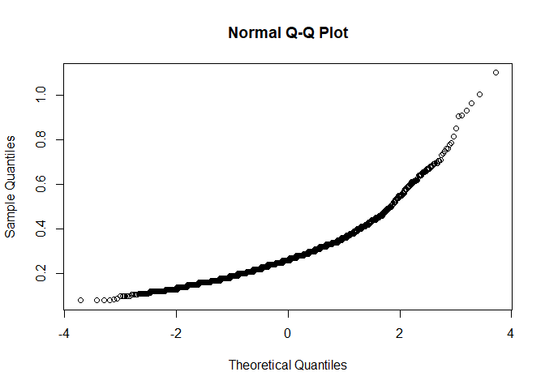
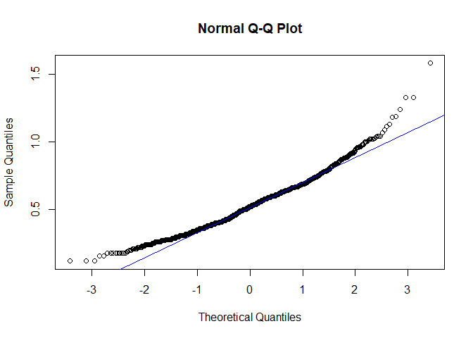
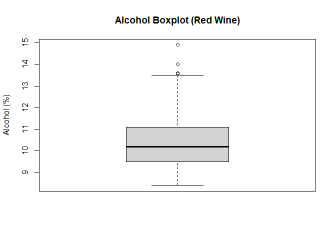
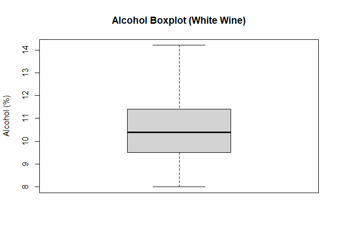
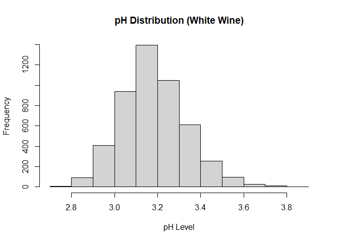
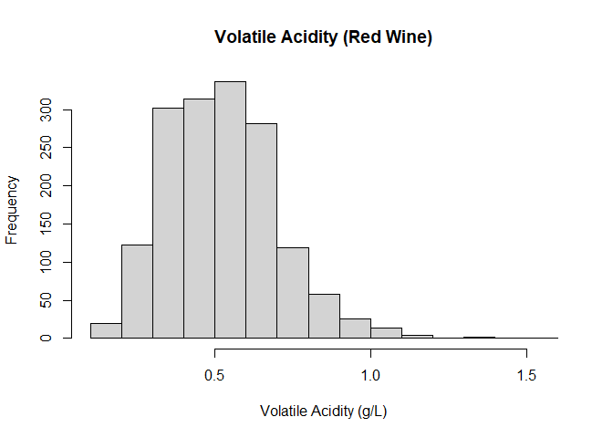
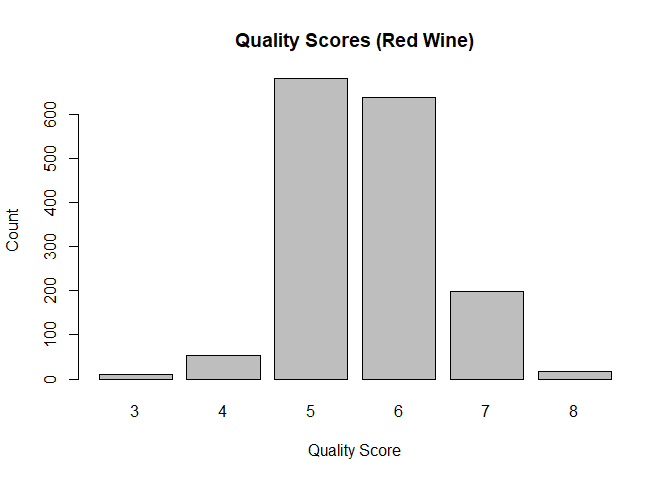

README
================

# Understanding Data Anaylss

There are many factors that contribute to wine quality. Some of the most
important ones to note are weather and climate, balance, and the wine
making process. We’ll start with the first: climate. Before making wine,
it is crucial to have high-quality grapes. Depending on the weather,
your grapes could either develop an abundance of flavors and juices or
end up lacking both. The type of wine someone wants can vary — for
example, in cooler climates, grapes tend to be higher in acidity. In
hotter climates, grapes tend to ripen more fully, leading to wines with
higher sugar content, higher alcohol levels, and a fuller body. Balance
in wine is also very important. You don’t want one element — whether
sweetness, acidity, tannin, alcohol, or body — to stand out
significantly more than the others. This is why winemakers sometimes let
their wine sit for months, or even years, to allow the elements to
balance each other out. Lastly, the winemaking process itself plays a
major role. From the choice of grapes to how those grapes are grown, to
fermentation methods and aging periods — every step matters. If one step
is not as carefully executed as the others, it can negatively impact the
final quality of the wine.

# Data Understanding

We have two data sets, one containing data based on red wine and the
other based on white wine. There’s a combined number of 6,947
observations. We have 24 number of features between the 2 data sets, 12
for each one.

The features the 2 data sets share are:

Features: fixed.acidity pH free.sulfur.dioxide quality volatile.acidity”
citric.acid  
residual.sugar chlorides  
total.sulfur.dioxide density  
sulfates alcohol

# Features and there data types/ descriptions

fixed.acidity- Amount of non-volatile acids in the wine (like tartaric
acid)\|Ratio  
volatile.acidity- Amount of volatile acids that can evaporate and cause
sour tastes\| Ratio  
citric.acid- Amount of citric acid, which adds freshness and flavor.\|
Ratio  
residual.sugar- Sugar left over after fermentation (affects sweetness)\|
Ratio  
chlorides- Salt content in the wine.\| Ratio  
free.sulfur.dioxide- Unbound SO₂ that protects wine from spoilage. \|
Ratio  
total.sulfur.dioxide-Total amount of SO₂ (free + bound) in the wine. \|
Ratio  
density- How heavy the wine is compared to water. \| Ratio  
pH- Measure of wine’s acidity or alkalinity. \| Interval  
sulfates- Sulfate salts that help preserve the wine.\| Ratio  
alcohol- Percentage of alcohol by volume in the wine \| Ratio  
quality- Wine’s quality score based on taste tests \| Ordinal

# Data preperations:

I loaded the data, via read.csv, when the data was laoded the it wasnt
in the proper order, the data was sperated by “;” rather then “,” so to
fix that I loaded the data, noting to spperate the data with comas
rather then ;.

# Modleing+Evaluating

Understanding the data’s structure\*

``` r
#loading data
white_wine_data = read.csv2("winequality-white.csv")
red_wine_data = read.csv2("winequality-red.csv")

#checking rows/col number
nrow(red_wine_data)
```

    ## [1] 1599

``` r
nrow(white_wine_data)
```

    ## [1] 4898

``` r
ncol(red_wine_data)
```

    ## [1] 12

``` r
ncol(white_wine_data)
```

    ## [1] 12

# checking for missing data

``` r
colSums(is.na(red_wine_data))
```

    ##        fixed.acidity 
    ##                    0 
    ##     volatile.acidity 
    ##                    0 
    ##          citric.acid 
    ##                    0 
    ##       residual.sugar 
    ##                    0 
    ##            chlorides 
    ##                    0 
    ##  free.sulfur.dioxide 
    ##                    0 
    ## total.sulfur.dioxide 
    ##                    0 
    ##              density 
    ##                    0 
    ##                   pH 
    ##                    0 
    ##            sulphates 
    ##                    0 
    ##              alcohol 
    ##                    0 
    ##              quality 
    ##                    0

``` r
colSums(is.na(white_wine_data))
```

    ##        fixed.acidity 
    ##                    0 
    ##     volatile.acidity 
    ##                    0 
    ##          citric.acid 
    ##                    0 
    ##       residual.sugar 
    ##                    0 
    ##            chlorides 
    ##                    0 
    ##  free.sulfur.dioxide 
    ##                    0 
    ## total.sulfur.dioxide 
    ##                    0 
    ##              density 
    ##                    0 
    ##                   pH 
    ##                    0 
    ##            sulphates 
    ##                    0 
    ##              alcohol 
    ##                    0 
    ##              quality 
    ##                    0

Based on the code, it looks like we have no missing values, in either
red or white wine data set.

# Looking at relationship’s within data before creating hypothesis\*

``` r
# Histogram of Alcohol in Red and White Wines
red_wine_data$alcohol = as.numeric(red_wine_data$alcohol)
white_wine_data$alcohol = as.numeric(gsub(",", ".", white_wine_data$alcohol))
hist(red_wine_data$alcohol, main = "Alcohol Distribution (Red Wine)", xlab = "Alcohol (%)")
```

<!-- -->

``` r
hist(white_wine_data$alcohol, main = "Alcohol Distribution (White Wine)", xlab = "Alcohol (%)")
```

<!-- -->

``` r
#Boxplot of alcohol
boxplot(red_wine_data$alcohol, main = "Alcohol Boxplot (Red Wine)", ylab = "Alcohol (%)")
```

<!-- -->

``` r
boxplot(white_wine_data$alcohol, main = "Alcohol Boxplot (White Wine)", ylab = "Alcohol (%)")
```

<!-- -->

``` r
# Histogram of pH in Red and White Wines
white_wine_data$pH = as.numeric(gsub(",", ".", white_wine_data$pH))
red_wine_data$pH = as.numeric(gsub(",", ".", red_wine_data$pH))
hist(red_wine_data$pH, main = "pH Distribution (Red Wine)", xlab = "pH Level")
```

<!-- -->

``` r
hist(white_wine_data$pH, main = "pH Distribution (White Wine)", xlab = "pH Level")
```

<!-- -->

``` r
#hist of volatitle
red_wine_data$volatile.acidity = as.numeric(gsub(",", ".", red_wine_data$volatile.acidity))
white_wine_data$volatile.acidity = as.numeric(gsub(",", ".", white_wine_data$volatile.acidity))
hist(red_wine_data$volatile.acidity, main = "Volatile Acidity (Red Wine)", xlab = "Volatile Acidity (g/L)")
```

<!-- -->

``` r
hist(white_wine_data$volatile.acidity, main = "Volatile Acidity (White Wine)", xlab = "Volatile Acidity (g/L)")
```

<!-- -->

``` r
#Barplot of wine quality
barplot(table(red_wine_data$quality), main = "Quality Scores (Red Wine)", xlab = "Quality Score", ylab = "Count")
```

<!-- -->

``` r
barplot(table(white_wine_data$quality), main = "Quality Scores (White Wine)", xlab = "Quality Score", ylab = "Count")
```

<!-- -->

# Hypotheses 1

I believe that the higher alcohol content a wine has, the higher the
wine quality will be. This is because alcohol can enhance the body and
flavor of wine, which are important factors in how quality is
perceived.”

# chekcing assuptions

``` r
white_wine_data$alcohol = gsub(",", ".", white_wine_data$alcohol)
white_wine_data$alcohol = as.numeric(white_wine_data$alcohol)  

# Checking to see if variable is normally distributed.
shapiro.test(white_wine_data$alcohol)
```

    ## 
    ##  Shapiro-Wilk normality
    ##  test
    ## 
    ## data:  white_wine_data$alcohol
    ## W = 0.9553, p-value <
    ## 2.2e-16

``` r
shapiro.test(red_wine_data$quality)
```

    ## 
    ##  Shapiro-Wilk normality
    ##  test
    ## 
    ## data:  red_wine_data$quality
    ## W = 0.85759, p-value <
    ## 2.2e-16

# stitical testing

``` r
#Test to see if there's correlation between the 2 varibales
cor.test(white_wine_data$alcohol, white_wine_data$quality, method = "spearman")
```

    ## Warning in
    ## cor.test.default(white_wine_data$alcohol,
    ## white_wine_data$quality, :
    ## Cannot compute exact p-value
    ## with ties

    ## 
    ##  Spearman's rank
    ##  correlation rho
    ## 
    ## data:  white_wine_data$alcohol and white_wine_data$quality
    ## S = 1.096e+10, p-value <
    ## 2.2e-16
    ## alternative hypothesis: true rho is not equal to 0
    ## sample estimates:
    ##       rho 
    ## 0.4403692

``` r
cor.test(red_wine_data$alcohol, red_wine_data$quality, method = "spearman")
```

    ## Warning in
    ## cor.test.default(red_wine_data$alcohol,
    ## red_wine_data$quality, :
    ## Cannot compute exact p-value
    ## with ties

    ## 
    ##  Spearman's rank
    ##  correlation rho
    ## 
    ## data:  red_wine_data$alcohol and red_wine_data$quality
    ## S = 355321833, p-value <
    ## 2.2e-16
    ## alternative hypothesis: true rho is not equal to 0
    ## sample estimates:
    ##       rho 
    ## 0.4785317

# Interpatation:

For both wines, p-value=2.2e-16. Since p-value was signicficantly \<
then 0.05 for both wines, we reject, thus meaning that there is a
statistically significant positive relationship between alcohol content
and wine quality.

# Hypothesis 2:

I think that the higher volatile acidity is the lower the wine’s quality
is, because Volatile acidity contributes sour, vinegar-like flavors that
usually have a negative effect on the taste and overall perception of
wine.

# checking assumptions:

``` r
#Checking to see if variable is normally distributed.
shapiro.test(white_wine_data$volatile.acidity)
```

    ## 
    ##  Shapiro-Wilk normality
    ##  test
    ## 
    ## data:  white_wine_data$volatile.acidity
    ## W = 0.90455, p-value <
    ## 2.2e-16

``` r
shapiro.test(white_wine_data$quality)
```

    ## 
    ##  Shapiro-Wilk normality
    ##  test
    ## 
    ## data:  white_wine_data$quality
    ## W = 0.88904, p-value <
    ## 2.2e-16

# Statistical Testing:

``` r
#

white_wine_data$volatile.acidity = as.numeric(gsub(",", ".", white_wine_data$volatile.acidity))
white_wine_data$quality = as.numeric(gsub(",", ".", white_wine_data$quality))

#Test to see if there's correlation between the 2 varibales
cor.test(white_wine_data$volatile.acidity, white_wine_data$quality, method = "spearman")
```

    ## Warning in
    ## cor.test.default(white_wine_data$volatile.acidity,
    ## white_wine_data$quality, :
    ## Cannot compute exact p-value
    ## with ties

    ## 
    ##  Spearman's rank
    ##  correlation rho
    ## 
    ## data:  white_wine_data$volatile.acidity and white_wine_data$quality
    ## S = 2.3434e+10, p-value <
    ## 2.2e-16
    ## alternative hypothesis: true rho is not equal to 0
    ## sample estimates:
    ##        rho 
    ## -0.1965617

``` r
cor.test(red_wine_data$volatile.acidity, red_wine_data$quality, method = "spearman")
```

    ## Warning in
    ## cor.test.default(red_wine_data$volatile.acidity,
    ## red_wine_data$quality, :
    ## Cannot compute exact p-value
    ## with ties

    ## 
    ##  Spearman's rank
    ##  correlation rho
    ## 
    ## data:  red_wine_data$volatile.acidity and red_wine_data$quality
    ## S = 940754860, p-value <
    ## 2.2e-16
    ## alternative hypothesis: true rho is not equal to 0
    ## sample estimates:
    ##        rho 
    ## -0.3806465

# Interpertation:

Since the p-values are much smaller than the significance level of 0.05,
we reject the null hypothesis in both cases. The negative correlation
coefficients suggest that higher volatile acidity is associated with
lower wine quality for both red and white wines.  
Thus, the data supports the hypothesis that higher levels of volatile
acidity negativly impacts wine quality.

# Hypothesis 3:

Due to being fermented longer, which can lead to higher alcohol
concentrations compared to white wines. I belive that red wines have a
higher average alcohol content than white wines.

# Checking assumptions:

``` r
#Checking to see if variable is normally distributed.
shapiro.test(white_wine_data$alcohol)
```

    ## 
    ##  Shapiro-Wilk normality
    ##  test
    ## 
    ## data:  white_wine_data$alcohol
    ## W = 0.9553, p-value <
    ## 2.2e-16

``` r
shapiro.test(red_wine_data$alcohol)
```

    ## 
    ##  Shapiro-Wilk normality
    ##  test
    ## 
    ## data:  red_wine_data$alcohol
    ## W = 0.92884, p-value <
    ## 2.2e-16

``` r
#Checking the spread of the two data's
var.test(white_wine_data$alcohol, red_wine_data$alcohol)
```

    ## 
    ##  F test to compare two
    ##  variances
    ## 
    ## data:  white_wine_data$alcohol and red_wine_data$alcohol
    ## F = 1.3335, num df = 4897,
    ## denom df = 1598, p-value =
    ## 5.947e-12
    ## alternative hypothesis: true ratio of variances is not equal to 1
    ## 95 percent confidence interval:
    ##  1.230150 1.443239
    ## sample estimates:
    ## ratio of variances 
    ##           1.333536

# Statistical testining\*

``` r
 #comparing medians 
wilcox.test(red_wine_data$alcohol, white_wine_data$alcohol)
```

    ## 
    ##  Wilcoxon rank sum test
    ##  with continuity correction
    ## 
    ## data:  red_wine_data$alcohol and white_wine_data$alcohol
    ## W = 3829044, p-value =
    ## 0.1818
    ## alternative hypothesis: true location shift is not equal to 0

# Interpertaions\*

Interpretation for Hypothesis 3: At first I used the Shapiro-Wilk test
which indicated that alcohol content in both red and white wines was not
normally distributed (p-value \< 2.2e-16 for both groups).  
Then the variance test showed that the variances between the two groups
were not equal (p-value = 5.947e-12).So I used the non-parametric
Wilcoxon rank-sum test to compare the alcohol contents. - The Wilcoxon
rank-sum test produced a p-value of 0.1818.  
Since the p-value is greater than the significance level of 0.05, we
fail to reject the null hypothesis. This suggests that there is no
statistically significant difference in the average alcohol content
between red and white wines in this dataset.

# conclusion

In this capstone deliverable, I was looking at data sets for white and
red wine. I researched a little bit of background information to better
help when performing EDA and statistical testing. In my testing, I
wanted to understand what indicators could be proven to have bettered
the quality of wine and indicators that do the opposite (worsen the
quality of wine). Based on my understanding of wine and aspects of wine,
I hypothesized and tested that the higher alcohol content a wine has,
the higher the wine quality will be. This turned out to be true — I know
this because the p-value for these statistical tests rejected the null,
resulting in there being a correlation between high levels of alcohol
and wine quality. I also tested if higher volatile acidity lowers wine’s
quality, because volatile acidity contributes sour, vinegar-like flavors
that usually have a negative effect on the taste and overall perception
of wine. After testing, I found that, as before, we rejected the null,
supporting the idea that there is a strong correlation between high
levels of volatile acidity and a decrease in wine quality. There also
proved to be a negative correlation coefficient, which suggests that
higher volatile acidity is associated with lower wine quality for both
red and white wines. Lastly, I tested if red wines had higher average
alcohol content than white wines, due to being fermented longer, which
can lead to higher alcohol concentrations compared to white wines. After
testing, it was proved that because the p-value is greater than the
significance level of 0.05, we fail to reject the null hypothesis. This
suggests that there is no statistically significant difference in the
average alcohol content between red and white wines in this dataset.
Overall, the statistical testing helped confirm that certain chemical
aspects like alcohol content and volatile acidity have a measurable
impact on wine quality. By using EDA and careful hypothesis testing, I
was able to better understand what makes a wine score higher or lower in
quality based on these features.
