README
================

# Understanding Data Anaylss

There are many factors that contribute to wine quality. Some of the most
important ones to note are weather and climate, balance, and the wine
making process. We’ll start with the first: climate. Before making wine,
it is crucial to have high quality grapes. Depending on the weather,
your grapes could either develop an abundance of flavors and juices or
end up lacking both. The type of wine someone wants can vary, for
example, in cooler climates, grapes tend to be higher in acidity. In
hotter climates, grapes tend to ripen more fully, leading to wines with
higher sugar content, higher alcohol levels, and a fuller body. Balance
in wine is also very important. You don’t want one element, whether
sweetness, acidity, tannin, alcohol, or body, to stand out significantly
more than the others. This is why winemakers sometimes let their wine
sit for months, or even years, to allow the elements to balance each
other out. Lastly, the wine making process itself plays a major role.
From the choice of grapes to how those grapes are grown, to fermentation
methods and aging period. If one step is not as carefully executed as
the others, it can negatively impact the final quality of the wine.

# Data Understanding

Summary We have two data sets, one containing data based on red wine and
the other based on white wine. There’s a combined number of 6,947
observations. We have 24 numbers of features between the 2 data sets, 12
for each one.

The features the 2 data sets share are:

Features: fixed.acidity pH free.sulfur.dioxide quality volatile.acidity”
citric.acid  
residual.sugar chlorides  
total.sulfur.dioxide density  
sulfates alcohol

# Features and there data types/ descriptions

fixed.acidity- Amount of non-volatile acids in the wine (like tartaric
acid)\|ordinal  
volatile.acidity- Amount of volatile acids that can evaporate and cause
sour tastes\| ordinal  
citric.acid- Amount of citric acid, which adds freshness and flavor.\|
ordinal  
residual.sugar- Sugar left over after fermentation (affects sweetness)\|
ordinal  
chlorides- Salt content in the wine.\| ordinal  
free.sulfur.dioxide- Unbound SO₂ that protects wine from spoilage. \|
ordinal  
total.sulfur.dioxide-Total amount of SO₂ (free + bound) in the wine. \|
ordinal  
density- How heavy the wine is compared to water. \| ordinal  
pH- Measure of wine’s acidity or alkalinity. \| Interval  
sulfates- Sulfate salts that help preserve the wine.\|ordinal  
alcohol- Percentage of alcohol by volume in the wine \| ordinal  
quality- Wine’s quality score based on taste tests \| Ordinal

# Data preperations:

I loaded the data, via read.csv, when the data was loaded the it wasn’t
in the proper order, the data was separated by “;” rather then “,” so to
fix that I loaded the data, noting to separated the data with comas
rather then ;.

# Modleing+Evaluating

Understanding the data’s structure\*

``` r
#loading data
white_wine_data = read.csv2("winequality-white.csv")
red_wine_data = read.csv2("winequality-red.csv")

#checking rows/col number
nrow(red_wine_data)
```

    ## [1] 1599

``` r
nrow(white_wine_data)
```

    ## [1] 4898

``` r
ncol(red_wine_data)
```

    ## [1] 12

``` r
ncol(white_wine_data)
```

    ## [1] 12

# Summary Statistics:

``` r
# Convert all columns to numeric safely, replacing comma with dot
red_wine_data[] <- lapply(red_wine_data, function(x) {
  as.numeric(gsub(",", ".", x))
})
summary(red_wine_data)
```

    ##  fixed.acidity   volatile.acidity  citric.acid    residual.sugar     chlorides       free.sulfur.dioxide
    ##  Min.   : 4.60   Min.   :0.1200   Min.   :0.000   Min.   : 0.900   Min.   :0.01200   Min.   : 1.00      
    ##  1st Qu.: 7.10   1st Qu.:0.3900   1st Qu.:0.090   1st Qu.: 1.900   1st Qu.:0.07000   1st Qu.: 7.00      
    ##  Median : 7.90   Median :0.5200   Median :0.260   Median : 2.200   Median :0.07900   Median :14.00      
    ##  Mean   : 8.32   Mean   :0.5278   Mean   :0.271   Mean   : 2.539   Mean   :0.08747   Mean   :15.87      
    ##  3rd Qu.: 9.20   3rd Qu.:0.6400   3rd Qu.:0.420   3rd Qu.: 2.600   3rd Qu.:0.09000   3rd Qu.:21.00      
    ##  Max.   :15.90   Max.   :1.5800   Max.   :1.000   Max.   :15.500   Max.   :0.61100   Max.   :72.00      
    ##  total.sulfur.dioxide    density             pH          sulphates         alcohol         quality     
    ##  Min.   :  6.00       Min.   :0.9901   Min.   :2.740   Min.   :0.3300   Min.   : 8.40   Min.   :3.000  
    ##  1st Qu.: 22.00       1st Qu.:0.9956   1st Qu.:3.210   1st Qu.:0.5500   1st Qu.: 9.50   1st Qu.:5.000  
    ##  Median : 38.00       Median :0.9968   Median :3.310   Median :0.6200   Median :10.20   Median :6.000  
    ##  Mean   : 46.47       Mean   :0.9967   Mean   :3.311   Mean   :0.6581   Mean   :10.42   Mean   :5.636  
    ##  3rd Qu.: 62.00       3rd Qu.:0.9978   3rd Qu.:3.400   3rd Qu.:0.7300   3rd Qu.:11.10   3rd Qu.:6.000  
    ##  Max.   :289.00       Max.   :1.0037   Max.   :4.010   Max.   :2.0000   Max.   :14.90   Max.   :8.000

# Red wine summary:

The red wine dataset includes 12 features that describe different
chemical properties. Alcohol ranges from 8.5% to 14%, with an average of
about 10.3%, and most wines have a quality rating around 6. Some
features like residual sugar and total sulfur dioxide have wide ranges,
suggesting a few extreme values. Overall, the data shows a good mix of
values, with some variables slightly higher in the top quartile.

``` r
white_wine_data[] <- lapply(white_wine_data, function(x) {
  as.numeric(gsub(",", ".", x))
})
summary(white_wine_data)
```

    ##  fixed.acidity    volatile.acidity  citric.acid     residual.sugar     chlorides       free.sulfur.dioxide
    ##  Min.   : 3.800   Min.   :0.0800   Min.   :0.0000   Min.   : 0.600   Min.   :0.00900   Min.   :  2.00     
    ##  1st Qu.: 6.300   1st Qu.:0.2100   1st Qu.:0.2700   1st Qu.: 1.700   1st Qu.:0.03600   1st Qu.: 23.00     
    ##  Median : 6.800   Median :0.2600   Median :0.3200   Median : 5.200   Median :0.04300   Median : 34.00     
    ##  Mean   : 6.855   Mean   :0.2782   Mean   :0.3342   Mean   : 6.391   Mean   :0.04577   Mean   : 35.31     
    ##  3rd Qu.: 7.300   3rd Qu.:0.3200   3rd Qu.:0.3900   3rd Qu.: 9.900   3rd Qu.:0.05000   3rd Qu.: 46.00     
    ##  Max.   :14.200   Max.   :1.1000   Max.   :1.6600   Max.   :65.800   Max.   :0.34600   Max.   :289.00     
    ##  total.sulfur.dioxide    density             pH          sulphates         alcohol         quality     
    ##  Min.   :  9.0        Min.   :0.9871   Min.   :2.720   Min.   :0.2200   Min.   : 8.00   Min.   :3.000  
    ##  1st Qu.:108.0        1st Qu.:0.9917   1st Qu.:3.090   1st Qu.:0.4100   1st Qu.: 9.50   1st Qu.:5.000  
    ##  Median :134.0        Median :0.9937   Median :3.180   Median :0.4700   Median :10.40   Median :6.000  
    ##  Mean   :138.4        Mean   :0.9940   Mean   :3.188   Mean   :0.4898   Mean   :10.51   Mean   :5.878  
    ##  3rd Qu.:167.0        3rd Qu.:0.9961   3rd Qu.:3.280   3rd Qu.:0.5500   3rd Qu.:11.40   3rd Qu.:6.000  
    ##  Max.   :440.0        Max.   :1.0390   Max.   :3.820   Max.   :1.0800   Max.   :14.20   Max.   :9.000

# white wine summary:

The white wine dataset includes 12 features as well and shows a wide
range in some values, especially residual sugar (up to 65.8 g/L) and
total sulfur dioxide (up to 440 mg/L). Alcohol content ranges from 8% to
14.2%, with an average around 10.5%. Most wines have a quality rating of
5 or 6, with a median of 6. Overall, the data seem well-distributed,
though some features show signs of high variability and possible
outliers.

# checking for missing data

``` r
colSums(is.na(red_wine_data))
```

    ##        fixed.acidity     volatile.acidity          citric.acid       residual.sugar            chlorides 
    ##                    0                    0                    0                    0                    0 
    ##  free.sulfur.dioxide total.sulfur.dioxide              density                   pH            sulphates 
    ##                    0                    0                    0                    0                    0 
    ##              alcohol              quality 
    ##                    0                    0

``` r
colSums(is.na(white_wine_data))
```

    ##        fixed.acidity     volatile.acidity          citric.acid       residual.sugar            chlorides 
    ##                    0                    0                    0                    0                    0 
    ##  free.sulfur.dioxide total.sulfur.dioxide              density                   pH            sulphates 
    ##                    0                    0                    0                    0                    0 
    ##              alcohol              quality 
    ##                    0                    0

Based on the code, it looks like we have no missing values, in either
red or white wine data set.

# Looking at relationship’s within data before creating hypothesis\*

``` r
# Histogram of Alcohol in Red and White Wines
par(mfrow = c(1, 2))  # Split plot area into 2 columns
hist(red_wine_data$alcohol, main = "Alcohol (Red Wine)", xlab = "Alcohol (%)", col = "red")
hist(white_wine_data$alcohol, main = "Alcohol (White Wine)", xlab = "Alcohol (%)", col = "white")
```

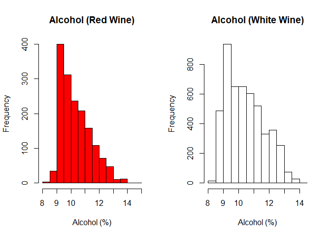<!-- -->

``` r
par(mfrow = c(1, 1))  # Reset layout
```

Here we’re using a histogram plot to show the average alcohol content in
wine. This type of plot is helpful because it clearly displays the most
common alcohol levels and highlights any potential outliers.

``` r
#Boxplot of alcohol
boxplot(red_wine_data$alcohol, main = "Alcohol Boxplot (Red Wine)", ylab = "Alcohol (%)")
```

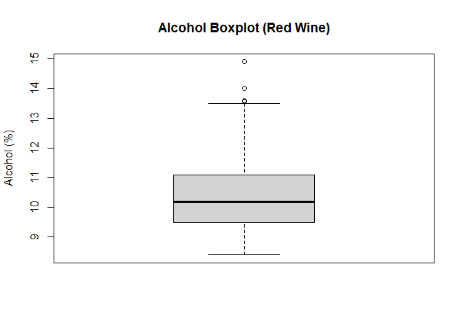<!-- -->

``` r
boxplot(white_wine_data$alcohol, main = "Alcohol Boxplot (White Wine)", ylab = "Alcohol (%)")
```

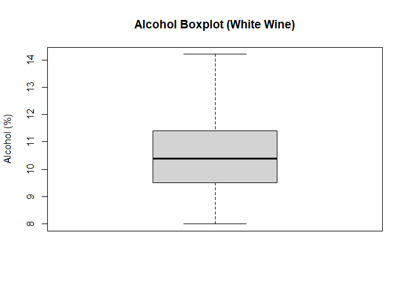<!-- -->

Here we use a boxplot to show the spread and distribution of alcohol
content in the wines. A boxplot is helpful because it clearly shows the
median, overall range, and any outliers in the data.

``` r
# Histogram of pH in Red and White Wines
white_wine_data$pH = as.numeric(gsub(",", ".", white_wine_data$pH))
red_wine_data$pH = as.numeric(gsub(",", ".", red_wine_data$pH))
hist(red_wine_data$pH, main = "pH Distribution (Red Wine)", xlab = "pH Level")
```

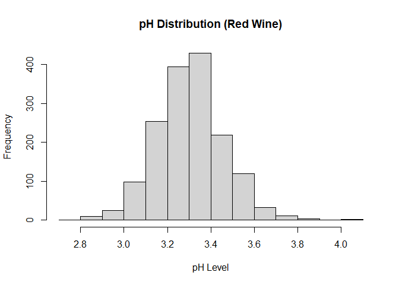<!-- -->

``` r
hist(white_wine_data$pH, main = "pH Distribution (White Wine)", xlab = "pH Level")
```

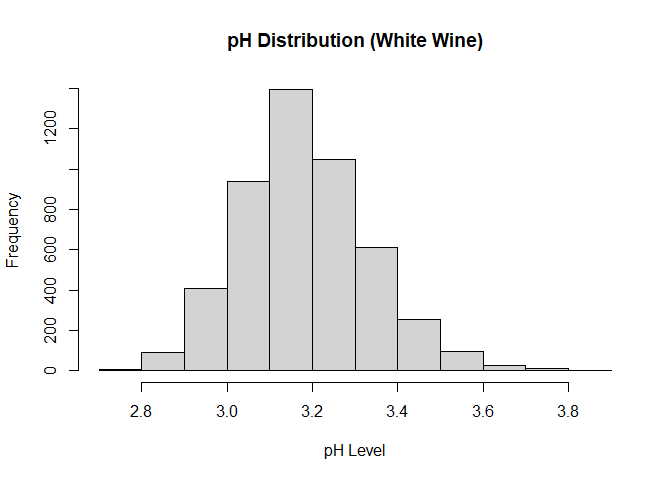<!-- -->

Again here we are using a box plot because it does the best at showing
us the distribution of pH levels in red and white wines. This way of
plotting helps us better analyze where most wines fall on the pH scale
and whether the data is skewed or contains any unusual values.

``` r
#hist of volatitle
red_wine_data$volatile.acidity = as.numeric(gsub(",", ".", red_wine_data$volatile.acidity))
white_wine_data$volatile.acidity = as.numeric(gsub(",", ".", white_wine_data$volatile.acidity))
hist(red_wine_data$volatile.acidity, main = "Volatile Acidity (Red Wine)", xlab = "Volatile Acidity (g/L)")
```

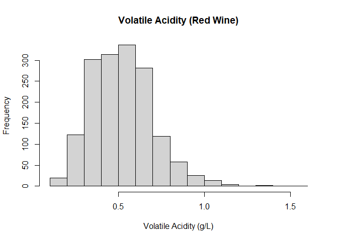<!-- -->

``` r
hist(white_wine_data$volatile.acidity, main = "Volatile Acidity (White Wine)", xlab = "Volatile Acidity (g/L)")
```

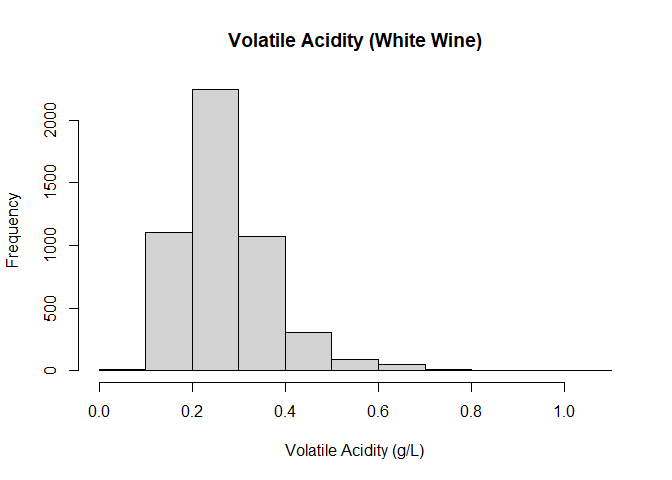<!-- -->

Here we want to analyze the distribution of volatile acidity, thus we
use a histogram. This type of plot helps us see how acidity levels are
spread across red and white wines and makes it easier to spot patterns
or outliers.

``` r
#Barplot of wine quality
barplot(table(red_wine_data$quality), main = "Quality Scores (Red Wine)", xlab = "Quality Score", ylab = "Count")
```

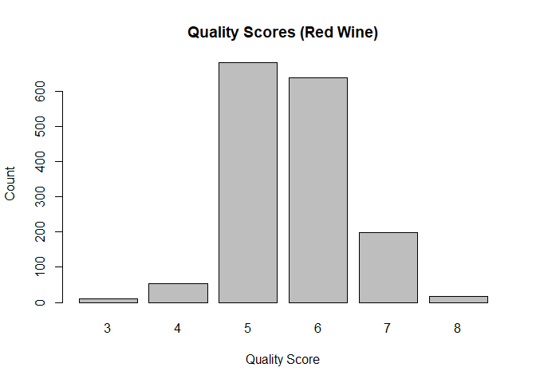<!-- -->

``` r
barplot(table(white_wine_data$quality), main = "Quality Scores (White Wine)", xlab = "Quality Score", ylab = "Count")
```

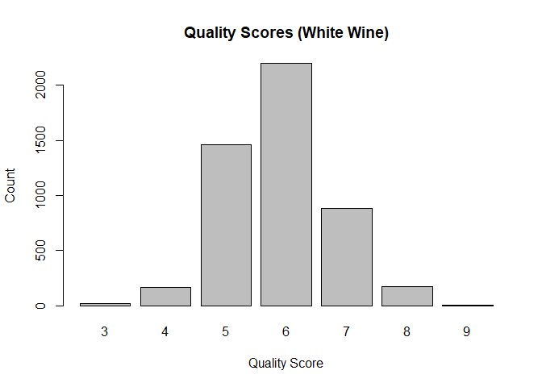<!-- -->

Due to wine quality being a discrete score, we use a bar plot to show
how often each quality rating appears. This helps us effectivly identify
the most common quality levels in red and white wines.

# Hypotheses 1

I believe that the higher alcohol content a wine has, the higher the
wine quality will be. This is because alcohol can enhance the body and
flavor of wine, which are important factors in how quality is
perceived.”

# chekcing normality:

``` r
qqnorm(white_wine_data$alcohol)
```

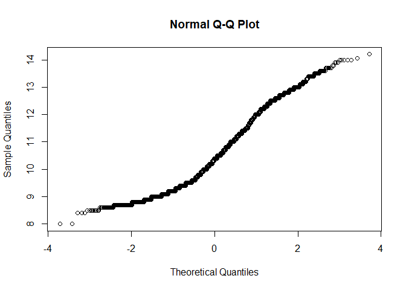<!-- -->

``` r
qqnorm(red_wine_data$alcohol)
qqline(white_wine_data$alcohol, col = "red")
```

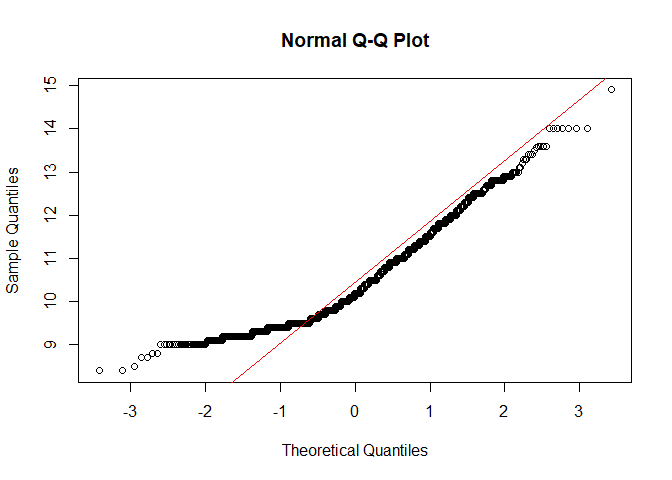<!-- -->

# statistical testing

``` r
#Test to see if there's correlation between the 2 varibales
cor.test(white_wine_data$alcohol, white_wine_data$quality, method = "spearman")
```

    ## Warning in cor.test.default(white_wine_data$alcohol, white_wine_data$quality, : Cannot compute exact p-value with ties

    ## 
    ##  Spearman's rank correlation rho
    ## 
    ## data:  white_wine_data$alcohol and white_wine_data$quality
    ## S = 1.096e+10, p-value < 2.2e-16
    ## alternative hypothesis: true rho is not equal to 0
    ## sample estimates:
    ##       rho 
    ## 0.4403692

``` r
cor.test(red_wine_data$alcohol, red_wine_data$quality, method = "spearman")
```

    ## Warning in cor.test.default(red_wine_data$alcohol, red_wine_data$quality, : Cannot compute exact p-value with ties

    ## 
    ##  Spearman's rank correlation rho
    ## 
    ## data:  red_wine_data$alcohol and red_wine_data$quality
    ## S = 355321833, p-value < 2.2e-16
    ## alternative hypothesis: true rho is not equal to 0
    ## sample estimates:
    ##       rho 
    ## 0.4785317

# Interpatation:

I first used the Shapiro-Wilk test to check for normality of the alcohol
and quality variables for both red and white wines. Since the p-values
were significantly less than 0.05, meaning the data was not normally
distributed, making parametric methods like Pearson correlation not
ideal. So instead I used Spearman correlation instead. For both wines,
the Spearman test returned a p-value \< 2.2e-16, and for white wine, a
rho of 0.44 — indicating a decent positive correlation between alcohol
content and wine quality. Thus we reject the null hypothesis and find
statistically significant support for the idea that higher alcohol
levels are associated with higher wine quality.

# Hypothesis 2:

I think that the higher volatile acidity is the lower the wine’s quality
is, because Volatile acidity contributes sour, vinegar-like flavors that
usually have a negative effect on the taste and overall perception of
wine.

# checking normality:

``` r
#Checking to see if variable is normally distributed.
qqnorm(white_wine_data$volatile.acidity)
```

<!-- -->

``` r
qqnorm(red_wine_data$volatile.acidity)
qqline(red_wine_data$volatile.acidity, col = "blue")
```

<!-- --> \#
Statistical Testing:

``` r
#

white_wine_data$volatile.acidity = as.numeric(gsub(",", ".", white_wine_data$volatile.acidity))
white_wine_data$quality = as.numeric(gsub(",", ".", white_wine_data$quality))

#Test to see if there's correlation between the 2 varibales
cor.test(white_wine_data$volatile.acidity, white_wine_data$quality, method = "spearman")
```

    ## Warning in cor.test.default(white_wine_data$volatile.acidity, white_wine_data$quality, : Cannot compute exact p-value with
    ## ties

    ## 
    ##  Spearman's rank correlation rho
    ## 
    ## data:  white_wine_data$volatile.acidity and white_wine_data$quality
    ## S = 2.3434e+10, p-value < 2.2e-16
    ## alternative hypothesis: true rho is not equal to 0
    ## sample estimates:
    ##        rho 
    ## -0.1965617

``` r
cor.test(red_wine_data$volatile.acidity, red_wine_data$quality, method = "spearman")
```

    ## Warning in cor.test.default(red_wine_data$volatile.acidity, red_wine_data$quality, : Cannot compute exact p-value with
    ## ties

    ## 
    ##  Spearman's rank correlation rho
    ## 
    ## data:  red_wine_data$volatile.acidity and red_wine_data$quality
    ## S = 940754860, p-value < 2.2e-16
    ## alternative hypothesis: true rho is not equal to 0
    ## sample estimates:
    ##        rho 
    ## -0.3806465

# Interpertation:

The Spearman test showed a statistically significant negative
correlation (rho = -0.197, p \< 2.2e-16), which supports the hypothesis
in direction. However, the weak strength of the relationship suggests
that volatile acidity plays only a small role, so the hypothesis is only
partially correct.

# Hypothesis 3:

Due to being fermented longer, which can lead to higher alcohol
concentrations compared to white wines. I belive that red wines have a
higher average alcohol content than white wines.

# Checking normality:

``` r
#Checking to see if variable is normally distributed.
shapiro.test(white_wine_data$alcohol)
```

    ## 
    ##  Shapiro-Wilk normality test
    ## 
    ## data:  white_wine_data$alcohol
    ## W = 0.9553, p-value < 2.2e-16

``` r
shapiro.test(red_wine_data$alcohol)
```

    ## 
    ##  Shapiro-Wilk normality test
    ## 
    ## data:  red_wine_data$alcohol
    ## W = 0.92884, p-value < 2.2e-16

# Statistical testining:

``` r
 #comparing medians 
wilcox.test(red_wine_data$alcohol, white_wine_data$alcohol)
```

    ## 
    ##  Wilcoxon rank sum test with continuity correction
    ## 
    ## data:  red_wine_data$alcohol and white_wine_data$alcohol
    ## W = 3829044, p-value = 0.1818
    ## alternative hypothesis: true location shift is not equal to 0

# Interpertaions:

Interpretation for Hypothesis 3: I first used the Shapiro-Wilk test,
which showed that alcohol content in both red and white wines was not
normally distributed (p \< 2.2e-16 for both). Because the assumptions
for a t-test were not met, I used the Wilcoxon rank-sum test, which is a
non-parametric alternative. The test returned a p-value of 0.1818, which
is greater than 0.05, so we fail to reject the null hypothesis. This
suggests there is no statistically significant difference in alcohol
content between red and white wines in this data set.

# conclusion:

In this project,I started by doing a bit of background research to help
me get a better understanding with wine and what factors are important
to wine quality. By doing so I was able to then perform EDA and
statistical tests to see which factors might make wine better or worse
in quality. First, I thought that wines with higher alcohol content
would have higher quality. I checked whether the data was normally
distributed, and it wasn’t, so I used a Spearman correlation test
instead. The results showed a clear positive relationship between
alcohol and wine quality (rho ≈ 0.44, p \< 2.2e-16), which supports my
idea — higher alcohol levels are linked to better wine quality. Next, I
tested whether higher volatile acidity would lead to lower wine quality,
since it can give wine a sour, vinegar-like taste. The data wasn’t
normal here either, so I used another Spearman test. I found a weak but
statistically significant negative correlation (rho ≈ -0.20), meaning
that more volatile acidity is generally linked to lower wine quality,
although the effect isn’t very strong. Lastly, I wanted to see if red
wine had more alcohol than white wine, based on the idea that red wines
are often fermented longer. I used the Wilcoxon rank-sum test because
the data wasn’t normal and the groups had different variances. The
result (p = 0.1818) showed no significant difference in alcohol content
between red and white wines in this dataset, so that hypothesis wasn’t
supported. In the end, the testing helped show that some things, like
alcohol content, really do seem to affect wine quality, while others,
like volatile acidity, matter too but not as much. Using EDA and
hypothesis testing gave me a better understanding of what betters or
worsen wine’s quality.
